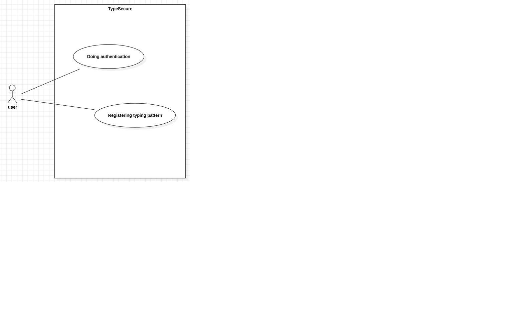

**Student No** : 22412002  
**Name** : 박수현  
**E-Mail** : bagsuhyeon271@gmail.com  
**Repository** : 
[TypeSecure_22412002](https://github.com/su-hyun617/TypeSecure_22412002)

 
 
 
 

## Revision History
|Revision date|Version|Description|Author|
|-|-|-|-|
|04/28/2026|1.0.0|First Draft|박수현|

 
 
 
 

## 📋 Table of Contents
* [1. Introduction](#1-introduction)
* [2. Use case analysis](#2-use-case-analysis)
* [3. Domain analysis](#3-domain-analysis)
* [4. User Interface prototype](#4-user-interface-prototype)
* [5. Glossary](#5-glossary)
* [6. References](#6-references)

 
 
 
 

## 1. Introduction
우리는 모든 것을 인터넷 서비스로 해결할 수 있는 시대에 살고 있다. 인터넷 서비스가 우리의 먹을 것, 입는 것, 등 다양한 서비스를 지원함에 따라 우리의 개인정보 보안에 대한 관심은 꾸준히 높아지고 있다. 

<표1>을 통해 알 수 있듯이 보안 산업의 막대한 발전에도 불구하고 보안의 취약점을 찾아 이를 악용하는 몇몇 사례가 계속해서 보고되고 있다. 이는 단순한 개인정보의 유출이 아닌 금융사기와 같은 막대한 2차 피해를 낳을 수 있다. 이와 같은 피해 사례를 줄이기 위해 자신의 타이핑 리듬을 통해 본인 인증을 진행하는 TypeSecure를 구상하였다.

TypeSecure는 기존의 지식 기반 인증이 가진 유출 위험을 보완하기 위해 설계되었다. 사용자가 평소 문장을 입력할 때 나타나는 고유한 타이핑 리듬을 데이터화하여 이를 제2차 인증 수단으로 활용한다. 이는 보안성과 사용자 경험 사이의 균형을 맞추기 위해 추가적인 인증 단계의 번거로움을 최소화하면서도 본인만이 가진 미세한 입력 습관을 정확하게 판별하므로 기존의 2차 인증 방법보다 더욱 편리하게 사용자 인증을 진행할 수 있다.

 
 
 
 

## 2. Use Case Analysis
### 2-1. Use Case Diagram

아래는 각 Use Case의 ID를 나타낸 것이다.
| Use Case Name | Use Case ID |
| :--- | :--- |
| **Registering typing pattern** | #1 |
| **Doing authentication** | #2 |

 
 

### 2-2. Use Case Desciption
### Use Case #1 : Registering typing pattern

| GENERAL CHARACTERISTICS | |
| :--- | :--- |
| **Summary** | 타이핑을 통해 user의 타이핑 패턴을 등록한다. |
| **Scope** | TypeSecure |
| **Level** | User Level |
| **Author** | 박수현 |
| **Last Update** | 2026-05-08 |
| **Status** | Analysis |
| **Primary Actor** | User |
| **Preconditions** | 웹사이트에 접속한 상태이다. |
| **Trigger** | 상단의 문구를 따라 타이핑한다. |
| **Success Post Condition** | user의 타이핑 패턴이 로컬 저장소에 저장된다. |
| **Failed Post Condition** | user의 타이핑 패턴이 로컬 저장소에 저장되지 않는다. |

| MAIN SUCCESS SCENARIO | |
| :--- | :--- |
| **Step** | **Action** |
| **S** | user가 상단의 문구를 따라 타이핑해 타이핑 패턴을 등록한다. |
| **1** | System은 메인 화면 상단에 입력할 문구를 제시한다. |
| **2** | user는 상단에 쓰여진 문구를 따라 타이핑한다. |
| **3** | user가 학습하기 버튼을 클릭하거나 enter 키를 눌러 입력을 완료한다. |
| **4** | System은 입력된 문자열이 올바른지 검증 후 타이핑 패턴을 저장한다. |
| **5** | System작성이 5회 이상 진행될 시 인증하기 버튼이 활성화한다. |
| **6** | user가 인증하기 버튼을 누를 경우 종료된다. |

| EXTENSION SCENARIOS | |
| :--- | :--- |
| **Step** | **Branching Action** |
| **3** | **3a. 입력 중 백스페이스 혹은 del 키 사용하는 경우**   3a.1. 백스페이스나 del 키를 감지할 시 입력을 중지한다.   3a.2. 현재 회차에 입력한 타이핑을 입력란에서 모두 제거한다.   3a.3. 해당 회차로 얻은 타이핑 데이터를 discard한다. |
| **4** | **4a. 입력 문구가 상단 문구와 불일치할 경우**   4a.1. 문자열 불일치를 감지할 경우 "오타가 발견되었습니다. 재입력하세요." 메세지를 팝업창으로 띄운다.   4a.2. 해당 회차의 타이핑 데이터를 discard한다.   4a.3. 메인 화면으로 돌아간다. |

| RELATED INFORMATION | |
| :--- | :--- |
| **Performance** | ≦ 3 Seconds |
| **Frequency** | Variable |
| **Concurrency** | None |
| **Due Date** | 2026-05-08 |

 
 

### Use Case #2 : Doing Authentication

| GENERAL CHARACTERISTICS | |
| :--- | :--- |
| **Summary** | 현재 입력된 타이핑 리듬을 로컬 저장소에 저장된 타이핑 데이터와 비교하여 본인인증을 진행한다. |
| **Scope** | TypeSecure |
| **Level** | User Level |
| **Author** | 박수현 |
| **Last Update** | 2026-05-08 |
| **Status** | Analysis |
| **Primary Actor** | User |
| **Preconditions** | 시스템에 사용자의 타이핑 데이터가 저장되어 있어야 한다. |
| **Trigger** | 사용자가 문구를 입력한 뒤 인증하기 버튼을 누른다. |
| **Success Post Condition** | 인증 성공 화면이 출력된다. |
| **Failed Post Condition** | 인증 성공 화면이 출력되지 않는다. |

| MAIN SUCCESS SCENARIO | |
| :--- | :--- |
| **Step** | **Action** |
| **S** | user가 상단의 문구를 따라 타이핑해 사용자가 본인임을 인증한다. |
| **1** | System이 메인 화면 상단에 입력할 문구를 제시한다. |
| **2** | user는 상단에 쓰여진 문구를 따라 타이핑한다. |
| **3** | user가 인증하기 버튼을 클릭하거나 enter 키를 눌러 입력을 완료한다. |
| **4** | System은 문자의 오타 여부 및 로컬 저장소의 타이핑 데이터와의 유사도를 확인한다. |
| **5** | System은 타이핑 리듬 유사도와 함께 성공 여부를 화면에 표시한다. |
| **6** | System은 해당 타이핑 데이터를 기존 데이터에 추가하고 메인 화면으로 돌아간다. |

| EXTENSION SCENARIOS | |
| :--- | :--- |
| **Step** | **Branching Action** |
| **2** | **2a. 입력 중 백스페이스 혹은 del 키 사용하는 경우**   2a.1. 백스페이스나 del 키를 감지할 시 입력을 중지한다.   2a.2. 현재 회차에 입력한 타이핑을 입력란에서 모두 제거한다.   2a.3. 해당 회차로 얻은 타이핑 데이터를 discard한다. |
| **4** | **4a. 입력 문구가 상단 문구와 불일치할 경우**   4a.1. 문자열 불일치를 감지할 경우 해당 회차의 타이핑 데이터를 discard한다.   4a.2. "오타가 발견되었습니다. 재입력하세요." 메세지를 팝업창으로 띄운다.   4a.3. 메인 화면으로 돌아간다.    **4b. 유사도가 임계값보다 작을 경우**   4b.1. "인증 실패!(유사도 : XX%)" 메세지를 화면에 출력한다.   4b.2. 메인 화면으로 돌아간다. |

| RELATED INFORMATION | |
| :--- | :--- |
| **Performance** | ≦ 3 Seconds |
| **Frequency** | Variable |
| **Concurrency** | None |
| **Due Date** | 2026-05-08 |

 
 
 
 

## 3. Domain Analysis
1) textSource  
   user가 입력할 text data를 출력하는 클래스이다. 이를 통해 사용자가 다양한 키를 입력할 때의 타이핑 데이터를 얻을 수 있다.
   
2) inputKey  
   user의 키 입력을 확인하고 오타, backspace, del 키를 관리하는 역할을 하는 클래스이다.
   
3) rhythmBuffer  
   오타나 backspace 혹은 del 키를 입력할 때 해당 데이터를 discard하므로 올바른 입력임을 확인하기까지 입력 데이터를 임시로 보관하는 클래스이다.
   
4) typecheck  
   user가 쓴 타이핑이 textSource에서 제공된 text data와 동일한지 확인하는 클래스이다.
   
5) makePattern  
   rhythmBuffer에서 받은 데이터를 리듬 배열로 변환하는 클래스이다.
   
6) smilarity  
   인증 과정에서 user가 친 타이핑 데이터와 기존의 데이터 간의 유사도를 계산하는 클래스이다.

7) patternUpdate  
   학습 및 인증이 성공할 경우 해당 타이핑 데이터를 기존의 타이핑 데이터에 누적하여 정확성을 계속해서 높여주는 클래스이다.

8) result  
   결과 및 유사도를 화면에 출력하는 클래스이다.

9) display   
   인증하기 버튼 활성화, text data 교체 등 UI를 전반으로 다루는 클래스이다.

