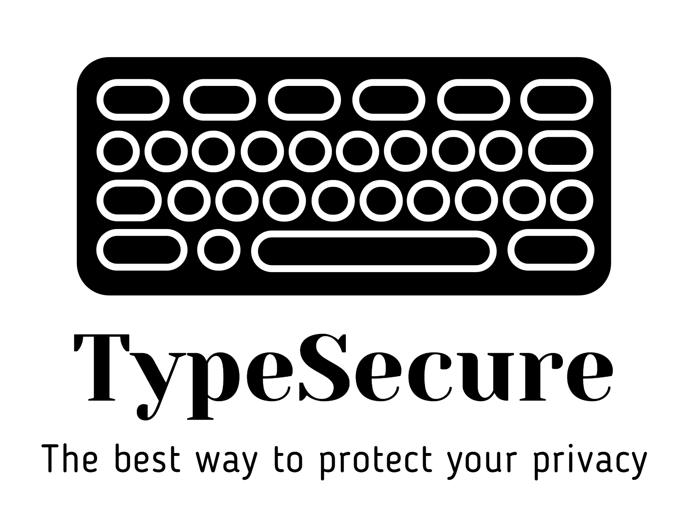
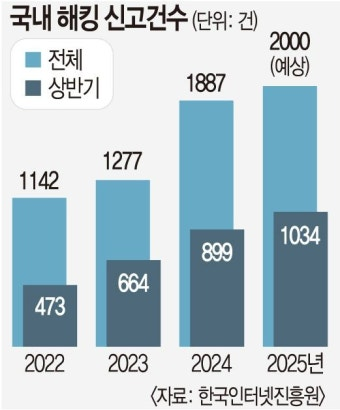

**Student No** : 22412002  
**Name** : 박수현  
**E-Mail** : bagsuhyeon271@gmail.com  
**Repository** : 
[TypeSecure_22412002](https://github.com/su-hyun617/TypeSecure_22412002)

 
 
 
 

## Revision History
|Revision date|Version|Description|Author|
|-|-|-|-|
|04/28/2026|1.0.0|First Draft|박수현|

 
 
 
 

## 📋 Table of Contents
* [1. Introduction](#1-introduction)
* [2. Use case analysis](#2-use-case-analysis)
* [3. Domain analysis](#3-domain-analysis)
* [4. User Interface prototype](#4-user-interface-prototype)
* [5. Glossary](#5-glossary)
* [6. References](#6-references)

 
 

## 1. Introduction
우리는 모든 것을 인터넷 서비스로 해결할 수 있는 시대에 살고 있다. 인터넷 서비스가 우리의 먹을 것, 입는 것, 등 다양한 서비스를 지원함에 따라 우리의 개인정보 보안에 대한 관심은 꾸준히 높아지고 있다. 

<표1>을 통해 알 수 있듯이 보안 산업의 막대한 발전에도 불구하고 보안의 취약점을 찾아 이를 악용하는 몇몇 사례가 계속해서 보고되고 있다. 이는 단순한 개인정보의 유출이 아닌 금융사기와 같은 막대한 2차 피해를 낳을 수 있다. 이와 같은 피해 사례를 줄이기 위해 자신의 타이핑 리듬을 통해 본인 인증을 진행하는 TypeSecure를 구상하였다.

TypeSecure는 기존의 지식 기반 인증이 가진 유출 위험을 보완하기 위해 설계되었다. 사용자가 평소 문장을 입력할 때 나타나는 고유한 타이핑 리듬을 데이터화하여 이를 제2차 인증 수단으로 활용한다. 이는 보안성과 사용자 경험 사이의 균형을 맞추기 위해 추가적인 인증 단계의 번거로움을 최소화하면서도 본인만이 가진 미세한 입력 습관을 정확하게 판별하므로 기존의 2차 인증 방법보다 더욱 편리하게 사용자 인증을 진행할 수 있다.
