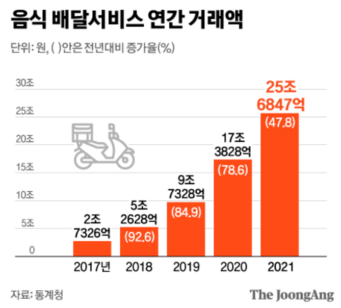
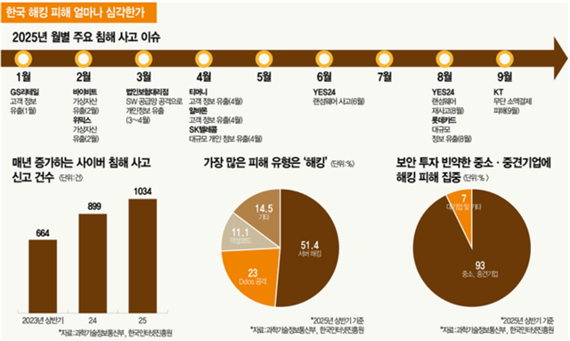

**Student No** : 22412002  
**Name** : 박수현  
**E-Mail** : bagsuhyeon271@gmail.com  
**Repository** : [TypeSecure_22412002_suhyun](https://github.com/su-hyun617/TypeSecure_22412002)

 
 
 
 

## Revision History
|Revision date|Version|Description|Author|
|-|-|-|-|
|03/17/2026|1.0.0|First Draft|박수현|

 
 
 
 

## 📋 Table of Contents
* [1. Business Purpose](#1-business-purpose)
* [2. System Context Diagram](#2-system-context-diagram)
* [3. Use Case List](#3-use-case-list)
* [4. Concept of Operation](#4-concept-of-operation)
* [5. Problem statement](#5-problem-statement)
* [6. Glossary](#6-glossary)
* [7. References](#7-references)

 
 

## 1. Business Purpose
### 1. Project Background

우리는 현재 모든 것을 온라인으로 할 수 있는 시대에 살고 있다. 먹을 것, 입는 것 등 다양한 것들을 개인의 계정으로 로그인하여 누워서도 살 수 있는 시대가 온 것이다. 그러나 이처럼 우리의 생활을 편하게 해주는 여러 플랫폼의 계정들이 우리의 개인정보를 유출하는 데에 주요한 역할을 하기도 한다. 

### 2. Motivation

<표 2>에 따르면 지난 한 해 동안 10건 이상의 주요 침해 사고가 발생하였다. 이러한 사이버 침해 사고 신고 건수가 매년 증가하는 추세이며 이는 분명히 실질적인 사회의 위협으로 대두되고 있다. 특히 해킹 사고로 인해 자신의 집주소나 구매 내역과 같은 민감한 개인정보가 단순 유출에 그치지 않고 보이스피싱과 같은 2차 피해 및 명의 도용을 통한 금융 범죄 등의 심각한 문제가 생길 수 있다.

### 3. Goal
 개인정보 유출로 인한 사고를 막기 위해 단순한 개인정보를 넘어 개인 고유의 타이핑 리듬을 이용한 새로운 보안 체제를 구상해보았다. 이와 유사한 행동 기반의 보안 개념이 존재해왔으나 기존의 리듬 분석이 단순히 입력 속도나 타자수에 중점을 두는 방안으로 타인이 사용자의 속도를 흉내낼 경우 보안성이 급격히 낮아지는 단점이 있다. 본 시스템에서는 최근의 비밀번호에 많이 보이는 유형인 특수문자 사용에 더욱 큰 가중치를 두어 분석하는 알고리즘을 설계하였다. 특수문자는 일반 알파벳이나 숫자와 달리 키보드상의 이동 거리가 멀고 shift 키와의 동시 입력이 필요하기에 타인이 복제하기에 매우 까다롭다. 

### 4. Target Market
해당 알고리즘은 특히나 보안이 중요한 금융 및 사내 메신저 사용자나 2차 보안을 번거로워하는 사람들의 개인정보를 안전하게 보호하며 UX를 높이는 방안이 될 수 있을 것이다.
