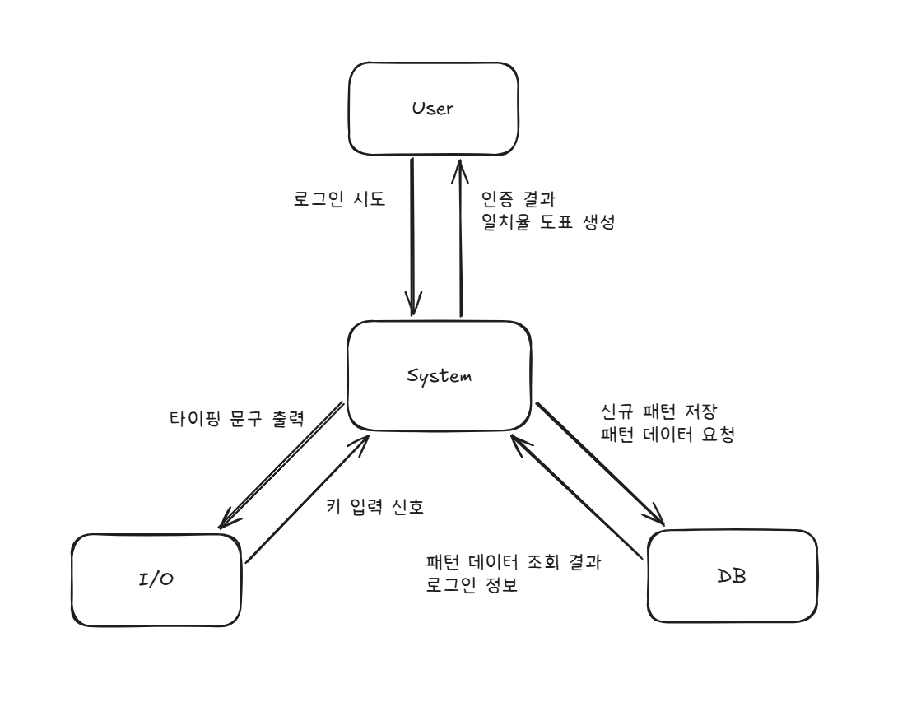

**Student No** : 22412002  
**Name** : 박수현  
**E-Mail** : bagsuhyeon271@gmail.com  
**Repository** : [TypeSecure_22412002](https://github.com/su-hyun617/TypeSecure_22412002)

 
 
 
 

## Revision History
|Revision date|Version|Description|Author|
|-|-|-|-|
|03/26/2026|1.0.0|First Draft|박수현|

 
 
 
 

## 📋 Table of Contents
* [1. Business Purpose](#1-business-purpose)
* [2. System Context Diagram](#2-system-context-diagram)
* [3. Use Case List](#3-use-case-list)
* [4. Concept of Operation](#4-concept-of-operation)
* [5. Problem statement](#5-problem-statement)
* [6. Glossary](#6-glossary)
* [7. References](#7-references)

 
 

## 1. Business Purpose
### 1. Project Background

우리는 현재 모든 것을 온라인으로 할 수 있는 시대에 살고 있다. 먹을 것, 입는 것 등 다양한 것들을 개인의 계정으로 로그인하여 누워서도 살 수 있는 시대가 온 것이다. 그러나 이처럼 우리의 생활을 편하게 해주는 여러 플랫폼의 계정들이 우리의 개인정보를 유출하는 데에 주요한 역할을 하기도 한다. 

### 2. Motivation

<표 2>에 따르면 지난 한 해 동안 10건 이상의 주요 침해 사고가 발생하였다. 이러한 사이버 침해 사고 신고 건수가 매년 증가하는 추세이며 이는 분명히 실질적인 사회의 위협으로 대두되고 있다. 특히 해킹 사고로 인해 자신의 집주소나 구매 내역과 같은 민감한 개인정보가 단순 유출에 그치지 않고 보이스피싱과 같은 2차 피해 및 명의 도용을 통한 금융 범죄 등의 심각한 문제가 생길 수 있다.

### 3. Goal
 개인정보 유출로 인한 사고를 막기 위해 단순한 개인정보를 넘어 개인 고유의 타이핑 리듬을 이용한 새로운 보안 체제를 구상해보았다. 이와 유사한 행동 기반의 보안 개념이 존재해왔으나 기존의 리듬 분석이 단순히 입력 속도나 타자수에 중점을 두는 방안으로 타인이 사용자의 속도를 흉내낼 경우 보안성이 급격히 낮아지는 단점이 있다. 본 시스템에서는 최근의 비밀번호에 많이 보이는 유형인 특수문자 사용에 더욱 큰 가중치를 두어 분석하는 알고리즘을 설계하였다. 특수문자는 일반 알파벳이나 숫자와 달리 키보드상의 이동 거리가 멀고 shift 키와의 동시 입력이 필요하기에 타인이 복제하기에 매우 까다롭다. 

### 4. Target Market
해당 알고리즘은 특히나 보안이 중요한 금융 및 사내 메신저 사용자나 2차 보안을 번거로워하는 사람들의 개인정보를 안전하게 보호하며 UX를 높이는 방안이 될 수 있을 것이다.

 
 
 
 

## 2. System Context Diagram

 
 
 
 

## 3. Use Case List

1. 타이핑 습관 등록

| Actor | User, I/O, DB |
| :--- | :--- |
| **Description** | 사용자가 자신의 키보드로 여러 문장을 입력하면 시스템이 이를 분석하여 타이핑 패턴을 DB에 저장한다. |

 
 

2. 로그인

| Actor | User, DB |
| :--- | :--- |
| **Description** | 사용자가 자신의 아이디를 입력하여 로그인한다. 이 때 시스템은 해당 사용자의 패턴이 DB에 존재하는지 확인하고 없을 경우 타이핑 습관 등록 절차로 돌아간다. |

 
 

3. 타이핑 습관 분석

| Actor | I/O |
| :--- | :--- |
| **Description** | 사용자가 자신의 키보드로 입력하는 타이핑 습관 데이터를 실시간으로 수집하고 수치화한다. |

 
 

4. 사용자 분석

| Actor | User, DB |
| :--- | :--- |
| **Description** | 습관 분석에서 분석된 패턴과 DB에 저장된 패턴을 비교하여 일치율이 80%를 넘을 경우 사용자 본인임을 인증한다. |

 
 

5. 타이핑 습관 업데이트
   
| Actor | DB |
| :--- | :--- |
| **Description** | 인증에 성공한 경우 현재의 타이핑 데이터를 바탕으로 DB에 저장된 기존 타이핑 습관을 최신의 상태로 업데이트한다. |

 
 

6. 그래프 출력
   
| Actor | User, I/O|
| :--- | :--- |
| **Description** | 사용자의 타이핑 속도나 일치율을 시각화하여 I/O를 통해 사용자에게 그래프 형태로 제공한다. |

 
 
 
 

## 4. Concept Of Operation

1. 타이핑 습관 등록

| Purpose | 본인인증을 위한 타이핑 습관 데이터 수집 |
| :--- | :--- |
| **Approach** | I/O를 통해 사용자에게 다양한 문장을 입력하게 하고 이를 통해 사용자의 타이핑 습관 데이터를 수집한다.  |
| **Dynamics** | 앱 실행 직후 |
| **Goals** | 사용자의 문장을 입력받을 수 있는 입력란을 제공한다. |

 
 

2. 로그인

| Purpose | ID, PW를 통해 등록된 사용자인지 확인 |
| :--- | :--- |
| **Approach** | 사용자가 앱 실행 후 로그인 시 ID, PW를 입력하게 한다. |
| **Dynamics** | 로그인 버튼을 누른 직후 |
| **Goals** | 로그인 기능을 구현한다. |

 
 

3. 타이핑 습관 분석

| Purpose | 로그인할 때 입력된 타이핑을 타이핑 습관 데이터 추출  |
| :--- | :--- |
| **Approach** | I/O로부터 전달받은 데이터를 분석 알고리즘을 통해 습관 데이터로 변환한다. |
| **Dynamics** | ID, PW 입력 중 |
| **Goals** | 사용자의 타이핑 특징 데이터를 산출한다. |

 
 

4. 사용자 분석

| Purpose | 현재 사용자와 실제 소유자의 동일성 검증 |
| :--- | :--- |
| **Approach** | 로그인 시 수집된 패턴과 DB 내의 패턴을 대조하여 유사도를 계산한다. |
| **Dynamics** | 로그인 입력 직후 |
| **Goals** | 유사도가 80% 이상일 경우 사용자 본인임이 인증된다. |

 
 

5. 타이핑 습관 업데이트
   
| Purpose | 변화하는 사용자의 습관을 시스템에 지속적으로 반영 |
| :--- | :--- |
| **Approach** | 인증 성공 데이터를 기존 DB 데이터에 추가한다. |
| **Dynamics** | 본인 인증 성공 직후 |
| **Goals** | 시간이 흐름에 따라 변화하는 사용자의 습관을 학습하여 정확도를 유지한다. |

 
 

6. 그래프 출력

| Purpose | 자신의 타이핑 습관과 DB의 타이핑 습관을 그래프로 시각화 |
| :--- | :--- |
| **Approach** | 로그인 시 수집된 데이터를 표로 변환한다. |
| **Dynamics** | 로그인 완료 후 |
| **Goals** | 사용자의 타이핑 습관을 직관적인 시각 자료로 구현한다. |

 
 
 
 

## 5. Problem statement

### Overview
Typesecure은 사용자가 2차 인증을 사용하기 번거로워하거나 보안이 매우 중요한 금융 및 사내 메신저에 사용되어 사용자들의 개인정보를 지켜주는 보안 서비스이다. 보안 서비스인 만큼 사용자를 인증하기 위한 까다로운 방안을 필요로 한다. 이를 위해 신경 써야 할 problem statement를 살펴보겠다.

### 1. 데이터 정밀도와 수집 문제
시스템 성능이나 자바 가상 머신 스케줄링 때문에 키보드 입력 시간이 delay될 수 있다. 해당 오차가 발생할 경우 사용자 고유의 타이핑 리듬이 깨져 본인임에도 사용자 인증에 실패할 가능성이 있다. 이와 같은 문제를 해결하기 위해 최대한 정밀하게 시간을 측정하며 여러 번의 입력을 평균값 내어 오차 범위를 줄이는 방안을 필요로 한다.

### 2. 노이즈 처리의 어려움
사용자가 타이핑 중 백스페이스를 누르거나 중간에 급한 연락을 받는 등으로 인해 사용자의 타이핑 리듬이 깨질 수 있다. 이러한 데이터가 DB에 들어갈 경우 알고리즘에 치명적인 오류를 남기기 때문에 백스페이스를 누른 경우 이를 잘못된 데이터로 인식하고 해당 데이터를 discard한다.

### 3. 습관의 변화와 업데이트
사람은 컨디션이나 타이핑 환경에 따라 타이핑 속도에 변화가 있을 수 있다. 이와 같은 변화를 타인으로 인식하고 사용자 인증을 하지 못할 경우가 있을 수 있으므로 타이핑에 걸린 전체 시간보다는 다른 키와 특정 키를 누를 때의 시간적 차이, 말 그대로의 리듬에 중점을 두어 사용자를 구별한다.

 
 
 
 

## 6. Glossary

| 용어 | 설명 |
| :--- | :--- |
| TypeSecure | 프로젝트의 이름으로 개인의 고유한 타이핑 리듬을 통해 사용자를 인증해주는 2차 인증 프로그램 |
| 타이핑 리듬 | 사용자가 키보드를 칠 때 나타나는 시간적 간격의 고유한 패턴 |
| DB | 사용자의 타이핑 리듬을 저장하는 서버 |
| User | 해당 프로그램을 이용하여 앱에 접속을 시도하는 사람/로그인을 위한 타이핑을 DB의 사용자 리듬과 비교하며 사용자 인증을 진행함 |
| I/O | 입력과 출력의 약자/시스템이 외부와 데이터를 주고받는 모든 과정 |

 
 
 
 

## 7. References
[표 1] : https://www.joongang.co.kr/article/25066359  
[표 2] : https://www.mk.co.kr/news/economy/11424326
