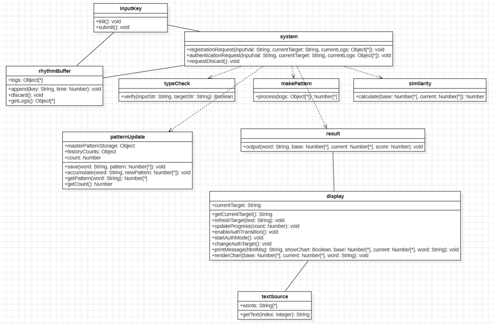
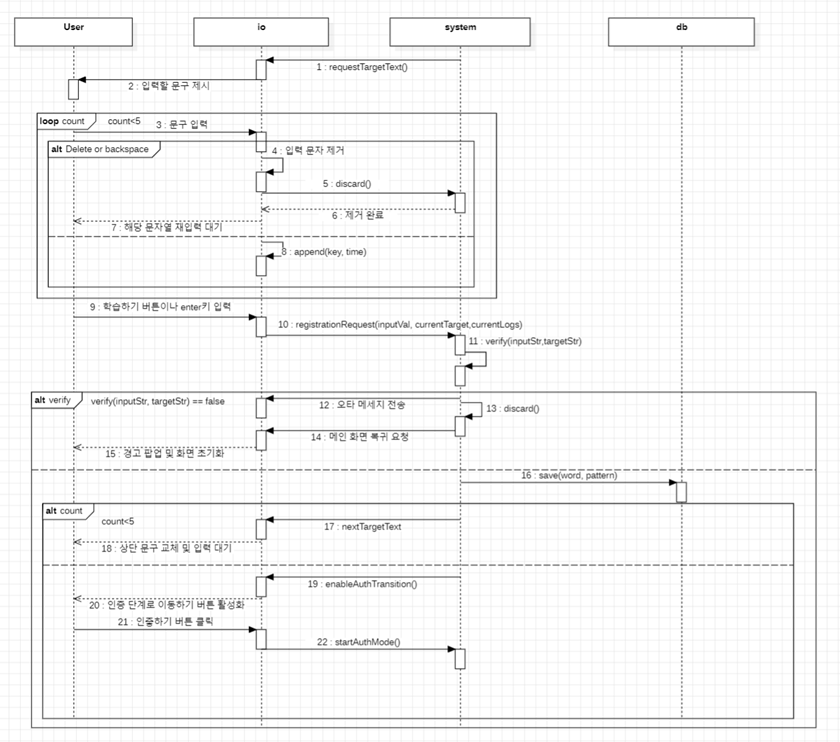
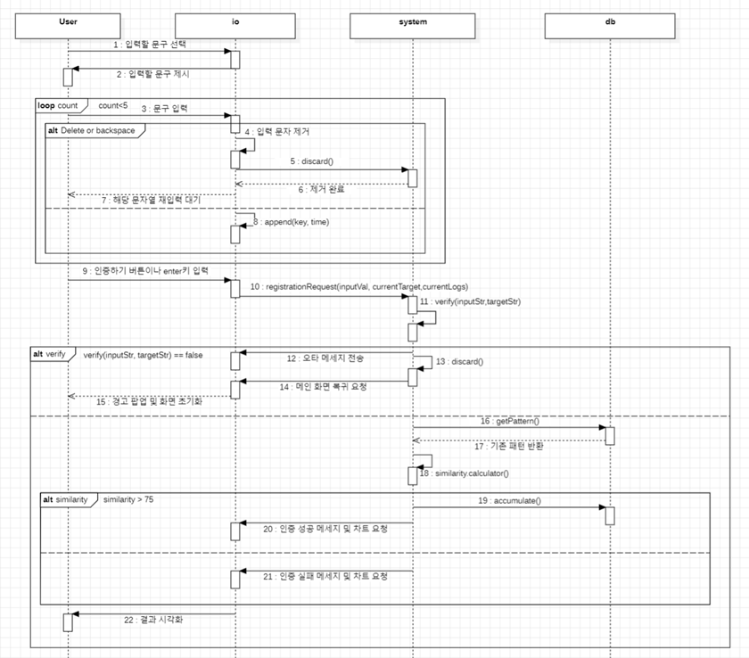
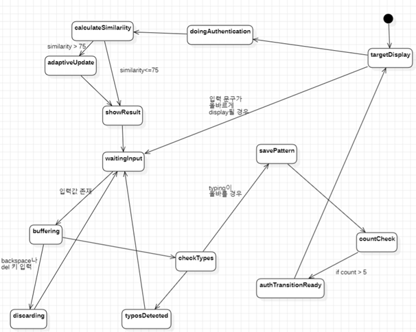

**Student No** : 22412002  
**Name** : 박수현  
**E-Mail** : bagsuhyeon271@gmail.com  
**Repository** : 
[TypeSecure_22412002](https://github.com/su-hyun617/TypeSecure_22412002)

 
 
 
 

## Revision History
|Revision date|Version|Description|Author|
|-|-|-|-|
|06/05/2026|1.0.0|First Draft|박수현|

 
 
 
 

## 📋 Table of Contents
* [1. Introduction](#1-introduction)
* [2. Class diagram](#2-class-diagram)
* [3. Sequence diagram](#3-sequence-diagram)
* [4. State machine diagram](#4-state-machine-diagram)
* [5. Implementation requirements](#5-implementation-requirements)
* [6. Glossary](#6-glossary)
* [7. References](#7-references)

 
 
 
 

## 1. Introduction
우리는 모든 것을 인터넷 서비스로 해결할 수 있는 시대에 살고 있다. 인터넷 서비스가 우리의 먹을 것, 입는 것 등 다양한 서비스를 지원함에 따라 우리의 개인정보 보안에 대한 관심은 꾸준히 높아지고 있다. 그러나 이러한 보안 산업의 막대한 발전에도 불구하고 기존의 고정된 비밀번호나 PIN 번호와 같은 지식 기반 인증 체계는 유출과 탈취라는 근본적인 취약점을 안고 있으며 이는 단순한 개인정보의 유출을 넘어 금융 사기와 같은 막대한 2차 피해로 이어지고 있다.

이와 같은 피해 사례를 줄이고 지식 기반 인증이 가진 유출 위험을 보완하기 위해 사용자가 평소 문장을 입력할 때 나타나는 고유한 타이핑 리듬을 데이터화하여 활용하는 TypeSecure를 고안하였다. TypeSecure는 보안성과 사용자 경험 사이의 균형을 맞추며 본인만이 가진 미세한 입력 습관을 판별하는 최적의 2차 인증 수단으로 제안되었다.

본 단계에서는 타이핑 리듬 분석 알고리즘을 시스템 구조로 구체화하기 위해 몇 가지 목표를 지정하였다. 첫째, 키 입력 이벤트를 실시간으로 포착하고 백스페이스나 딜리트와 같은 수정 키 입력 시 임시 데이터를 즉각 파기하는 메모리 버퍼 제어 구조를 설계한다. 둘째, 입력된 문자열의 오타를 검증하고 각 문구에 맞는 타이핑 간격 벡터를 정밀하게 추출하는 패턴 생성 및 동적 매핑 알고리즘을 구체화한다. 셋째, 학습된 생체 프로필 데이터와의 유클리드 거리 기반 유사도 연산 엔진과 이를 사용자에게 시각적으로 전달하는 인터페이스 컴포넌트를 설계한다.

이를 통해 TypeSecure의 Design 단계는 Analysis 단계에서 제안된 TypeSecure의 생체 인증 개념이 실제 프로그램 상에서 견고하게 동작할 수 있도록 설계 가이드라인을 정립하는 데 목적이 있다.

 
 
 
 

## 2. Class diagram

 
 

| Class Name | Explanation |
| :---: | --- |
| **textSource** | 사용자가 타이핑 패턴 등록 및 인증을 진행할 때 화면에 출력할 기준 텍스트 데이터를 제공하는 클래스이다.  - words0 : 학습 및 인증에 사용될 기준 문구들을 담은 배열 속성이다. - getText() : 특정 인덱스에 해당하는 기준 문자열을 반환하는 메소드이다. |
| **rhythmBuffer** | 사용자가 유효한 전체 문구를 정확히 입력하기 전까지 실시간으로 입력되는 개별 키의 값과 입력 시점 로그 데이터를 임시 보관하는 버퍼 클래스이다. 백스페이스나 델 키 감지 시 화면 입력 필드와 함께 데이터가 즉시 파기된다.  - logs : 키 값과 타임스탬프 쌍을 저장하는 임시 데이터 배열 속성이다. - append() : 새로운 키 입력을 버퍼 뒤에 추가하는 메소드이다. - discard() : 비정상 입력이나 수정 발생 시 화면의 입력란을 비우고 버퍼를 즉시 폐기하는 메소드이다. - getLogs() : 누적된 타임로그 전체를 반환하는 메소드이다. |
| **typeCheck** | 사용자가 최종 입력한 전체 문자열 스트림이 target 문구와 완벽하게 일치하는지 확인하는 검증 클래스이다.  - verify() : 두 문자열을 비교하여 오타 여부를 판별해 결과값을 반환하는 메소드이다. 반환값으로 boolean을 가진다. |
| **makePattern** | 오타 검증을 통과한 rhythmBuffer의 타임로그 데이터를 가공하여, 각 키 입력 간의 실제 시간 차이를 계산해 내는 리듬 프로필 변환 클래스이다.  - process() : 절대 시간 로그들을 연속된 시간 간격 배열로 계산하여 리듬 패턴을 추출하는 메소드이다. |
| **similarity** | 실시간 입력 스트림으로부터 변환된 현재 리듬 패턴과 patternUpdate에 저장된 기존 기저 데이터 간의 차이를 분석하여 수치적인 유사도를 계산하는 클래스이다.  - calculate() : 두 인터벌 배열의 평균 오차를 기반으로 0~100% 사이의 인증 유사도 점수를 산출하는 메소드이다. 두 패턴의 크기가 다를 경우 -1을 반환한다. |
| **patternUpdate** | 패턴 등록 성공 시 또는 본인 인증 성공 시 획득한 새로운 리듬 패턴을 기존 저장소에 누적·중첩 평균화하여 생체 인식 프로필의 정확도를 점진적으로 적응시키는 데이터 관리 클래스이다. 이 시스템은 별도의 외부 서버나 데이터베이스를 지원하지 않으므로 본 클래스가 내부 로컬 변수를 활용해 데이터베이스의 기능을 대신 수행한다.  - masterPatternStorage : 기준 단어별 마스터 패턴 프로필을 보관하는 객체 변수이다. - historyCounts : 단어별 누적 학습 및 갱신 횟수를 관리하는 변수이다. - count : 초기 학습의 총 완료 횟수를 기록하는 변수이다. - save() : 초기 패턴 데이터를 저장하고 총 카운트를 증가시키는 메소드이다. - accumulate() : 인증 성공 시 기존 기저 프로필 데이터와 신규 데이터를 누적 횟수 기반의 가중치 평균으로 중첩하여 누적 갱신하는 메소드이다. - getPattern() : 특정 단어의 기저 프로필 데이터를 반환하는 메소드이다. - getCount() : 현재까지 완료된 총 초기 학습 횟수를 반환하는 메소드이다. |
| **display** | 화면의 상단 안내 문구를 교체하고, 학습 진행 상황바를 갱신하며 인증하기 버튼을 동적으로 활성화하거나 차트를 실시간으로 그려내는 등 UI를 직접 제어하는 화면 관리 클래스이다.  - currentTarget : 현재 화면 상단에 출력되어 있는 사용자 입력 타깃 문구 변수이다. - getCurrentTarget() : 현재 타깃 문구를 리턴하는 메소드이다. - refreshTarget() : 제시되는 문자열 화면을 새 텍스트로 갱신하는 메소드이다. - updateProgress() : 학습 모드 진행도를 화면에 반영하고 안내 메시지를 출력하는 메소드이다. - enableAuthTransition() : 5회 등록 완료 시 학습 버튼을 숨기고 모드 전환 버튼을 화면에 활성화하는 메소드이다. - startAuthMode() : 전역 상태를 인증 모드로 전환하고 인증 타깃 선택 박스를 렌더링하는 메소드이다. - changeAuthTarget() : 사용자가 선택한 인증용 타깃 문구에 맞춰 화면 폼과 플레이스홀더를 최신화하는 메소드이다. - printMessage() : 결과 안내 텍스트를 UI에 출력하고 필요시 차트 재생성을 명령하는 메소드이다. - renderChart() : Chart 객체를 재생성하여 학습된 프로필 선 그래프와 현재 입력 스트림 리듬 선 그래프를 실시간으로 비교 시각화하는 메소드이다. |
| **result** | 최종 검증된 리듬 유사도 점수 및 성공/실패 여부를 사람이 인지할 수 있는 완성된 결과 형태의 메시지로 가공하여 display 레이어에 출력을 요청하는 결과 제어 클래스이다.  - output() : 최종 결과 판정을 내리고 최신 프로필 데이터를 로드하여 화면 출력 및 실시간 차트 렌더링을 요청하는 메소드이다. |
| **system** | inputKey로부터 사용자의 요청 컨텍스트를 이행받아 오타 검증, 리듬 패턴 추출, 유사도 산출, 적응형 누적 가중치 갱신 등 전체 비즈니스 로직과 데이터 파기를 순차 지휘하고 도메인 컴포넌트들을 총괄하는 시스템 아키텍처의 핵심 컨트롤러 클래스이다.  - registrationRequest() : 학습 모드일 때 오타 유무를 검사하고 유효 패턴을 DB에 5회 누적 등록 제어하는 메소드이다. - authenticationRequest() : 인증 모드일 때 기저 패턴과 유사도를 분석하여 75%이상 만족 시 생체 프로필을 가중 중첩 진화시키는 메소드이다. - requestDiscard() : 오타 발생이나 예외 상황 시 실시간 입력 데이터 세션을 일괄 파기하도록 명령하는 메소드이다. |
| **inputKey** | 사용자의 실시간 키보드 입력을 감지하고 이벤트 스트림을 버퍼링 레이어에 전달하며, 입력 완료 시 system 측으로 비즈니스 프로세스 처리 권한을 부여하는 클래스이다.  - init() : 키보드 이벤트 리스너 및 제출 버튼 클릭 이벤트를 등록하고 초기화하는 메소드이다. 백스페이스/델 키 입력 감지 시 buffer에 저장된 값을 즉시 삭제한다. - submit() : 입력 완료 시 호출되는 메소드로 전역 모드 상태를 파악하여 system 객체의 적절한 비즈니스 요청 함수로 제어권을 즉시 인계한다. |

 
 
 
 

## 3. Sequence diagram

아래의 설명은 시스템의 핵심 기능인 타이핑 리듬 학습에 대한 Sequence Diagram의 흐름과 메커니즘을 상세히 기술한 것이다.

초기 시스템이 접속되면 system 객체는 화면 레이어인 io에 제시할 기준 문구를 요청하며, io는 이를 받아 User 화면에 입력할 타깃 문구를 동적으로 시각화한다.

User가 텍스트 입력창에 타이핑을 시작하고 사용자가 수정 키를 입력하는 예외 상황이 감지되면 io 레이어는 화면상의 입력 문자를 즉시 제거하는 동시에 system에 누적되던 타이핑 리듬 데이터를 파기하도록 요청한다. system 내의 임시 버퍼가 초기화되면 제거 완료 신호가 반환되며 사용자는 해당 문자열을 처음부터 다시 재입력하는 대기 상태로 돌아간다. 정상적인 키 입력이 지속될 경우에는 개별 키 값과 입력 시점의 타임스탬프 데이터가 실시간으로 입력 버퍼에 기록된다.

사용자가 문구 입력을 마치고 학습하기 버튼을 클릭하거나 Enter 키를 입력하면 io는 system에 전체 입력 내용에 대한 확인 및 검증을 요청한다. system은 문자열 일치 여부를 확인하는 검증 절차를 수행한다.

입력 도중 오타가 발견되면 system은 io로 오타 안내 메시지를 전송하고 누적되어 있던 해당 회차의 타이핑 리듬 데이터를 즉시 메모리에서 삭제한다. 이후 메인 화면 복귀를 요청하여 화면에 경고 팝업을 출력하고 인풋 창을 깨끗하게 초기화한 뒤 재입력 대기 상태로 전환한다.

사용자가 제시된 문구를 오타 없이 정확하게 입력한 경우 추출된 타이핑 인터벌 리듬 패턴이 데이터베이스 역할을 수행하는 db 객체에 안전하게 저장된다

누적 학습 횟수가 5회 미만일 때 system은 다음 회차의 기준 단어를 선별하여 io에 전달하고, 상단 문구 교체와 함께 다음 문장 입력을 대기한다.

누적 학습 횟수가 5회 이상 완료될 때 인증 준비 완료 메시지를 화면에 출력한다. 동시에 인증 단계로 이동하기 버튼을 활성화되며 사용자가 해당 버튼을 클릭하면 인증하기 창으로 화면을 이동시킨다.

 
 

다음은 앞선 타이핑 리듬 학습을 기반으로 진행되는 본인 인증에 대한 Sequence Diagram이다.

사용자가 인증 단계로 진입하여 화면에서 입력할 문구 선택을 수행하면 io 레이어는 선택된 타깃 문구를 화면에 제시하며 사용자의 인증용 타이핑 스트림을 대기시킨다.

타이핑 완료 후 사용자가 '인증하기' 버튼을 누르거나 엔터를 입력하면, io는 사용자의 입력 값과 로그 컨텍스트를 담아 system 객체의 메소드를 호출하여 검증 프로세스를 위임한다. system`은 우선적으로 입력 문자열의 오타 유무를 엄격하게 검사한다.

인증 입력 스트림에서 오타가 발견될 경우 system은 즉시 오타 메시지 전송을 수행하고 무효화된 생체 데이터를 파기한다.

오타 검증을 통과하면 system은 사용자의 고유 생체 마스터 패턴을 대조하기 위해 db에서 기존 타이핑 데이터를 얻는다. 데이터를 확보한 system은 기존 패턴과 현재 입력된 리듬 패턴 간의 백분율 유사도 점수를 산출하며 산출된 점수를 바탕으로 로직을 수행한다.

산출된 리듬 유사도가 75%를 초과할 경우 본인 확인 성공 판정을 내린다. system` 방금 인증에 성공한 신규 리듬 패턴을 기존 기저 데이터와 누적 가중치 평균으로 중첩 갱신함으로써 사용자의 생체 프로필을 동적으로 진화시킨다.

문자열은 일치하나 타이핑 리듬 유사도가 임계치에 미달할 경우 타인의 변조 혹은 위조 스트림으로 간주하여 인증 실패 판정을 내린다.

최종적으로 io는 결과 데이터를 기반으로 화면에 기존의 타이핑 리듬과 현재의 타이핑 리듬의 차이를 그래프로서 나타낸다.
 
 
 
 

## 4. State machine diagram

 
 
 
 

## 5. Implementation requirements
### 1) Hardware Requirements

| Hardware Item | Specification |
| :--- | :--- |
| **CPU** | Intel Core i3 이상 |
| **RAM** | 4 GByte 이상 |
| **HDD or SSD** | 50MB 이상의 여유 공간) |
| **Network** | 웹 브라우저 기반 로컬 구동 방식으로, **연결 안 되어 있어도 됨** |

 
 

### 2) Software Requirements

| Software Item | Specification |
| :--- | :--- |
| **Operating System** | Windows 10 이상 |
| **Execution Environment** | 웹 브라우저 |
| **Implementation Language** | HTML5, CSS3, JavaScript |
| **External Libraries** | Chart.js |

 
 

### 3) Nonfunctional requirements
프로그램 검증 및 테스트를 위한 단어 데이터 목록은 TextSource 클래스 내에 존재한다. 사용자는 반드시 화면 상단에 제시된 예시와 똑같이 띄어쓰기, 대소문자, 문장 부호를 맞춰 타이핑 입력을 하여야 한다. 

다르게 입력을 할 경우 TypeCheck에서 불일치를 감지하여 오류가 날 수 있으며, 오류가 발생할 시 "오타가 발견되었습니다. 재입력하세요."라는 안내와 함께 해당 회차의 리듬 데이터는 즉시 discard된다. 시스템에 정상적으로 접속하여 정해진 시퀀스를 실행하면 자동으로 데이터가 쌓이고 활성화된다.

 
 
 
 

## 6. Glossary
| 용어 | 설명 |
| :--- | :--- |
| TypeSecure | 프로젝트의 이름으로 개인의 고유한 타이핑 리듬을 통해 사용자를 인증해주는 2차 인증 프로그램 |
| 타이핑 리듬 | 사용자가 키보드를 칠 때 나타나는 시간적 간격의 고유한 패턴 |
| Class Diagram | 클래스의 내부 구성요소 및 클래스간의 관계를 도식화하여 시스템의 특정 모듈이나 전체를 구조화하는 통합 
모델링 언어 |
| Sequence Diagram | 시간의 흐름에 따라 객체들이 메시지를 주고받는 상호 작용을 명세히 나타내는 다이어그램 |
| State Machine Diagram| 객체의 상태와 상태의 변화를 도식화 한 다이어그램  |

 
 
 
 

## 7. References
Design with examples의 예시들
